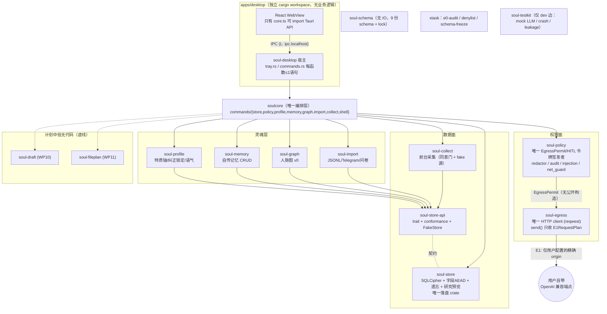

MODEL: claude-fable-5-thinking-xhigh

# Round 1 架构审计 — Soul 项目全局架构 / 产品锁定对照

审计人：fable 架构审计子代理（只读）。日期：2026-08-24。
证据全部来自远程分支只读读取（`git show` / `git ls-tree` / `gh` 只读查询），未 checkout、未修改任何仓库文件。

---

## 一句话现状

Soul 的产品定义已三轮双模型扫描冻结（PR #1），Goal 1 的 13 个 crate + Tauri 桌面壳已在 PR #2 落地约 4.4 万行并自带异常严密的红线测试，**但代理层（起草 WP10、文件计划 WP11）与发布面（安装 smoke WP13）尚未开始，Windows 真机密钥保护（DPAPI）是明确骨架缺口，且全部资产悬在两个未合并的 Draft PR 上——`main` 只有一行 README**。

---

## 产品锁定摘要

来源：`origin/cursor/soul-product-lock-7b1c:docs/PRODUCT_LOCK.md`（与 goal1 分支逐字节一致，`git diff` 为空）。

核心定义：Soul 是「灵魂级个人软件」——本机复刻电子版用户（人格 / 记忆 / 心理工作模型 / 人脉图），Windows 11 x64 本地优先，v0.1 零业务出网（E0 无代码路径），只起草不发送，采集默认全关，第三人数据默认不出本机，研究轨道只预览不落盘。技术栈 Tauri 2 + Rust + React/TS，加密 SQLite（SQLCipher + 字段级 AEAD），遗忘 = 销毁内容密钥。

### v0.1 的 13 条垂直切片 → 代码对应

| # | 切片（PRODUCT_LOCK「v0.1 最小垂直切片」） | 代码对应（`origin/cursor/soul-goal1-7b1c:`） | 状态 |
|---|---|---|---|
| 1 | 安装、托盘、向导（权限默认关） | `apps/desktop/`（tray.rs、Wizard.tsx、shell_is_local_only.rs） | **部分**：壳+托盘+向导已落；安装器（`tauri build`）从未跑过，托盘/UAC 需作者 Windows 手动 |
| 2 | 问卷 + soul-import-v1 / Telegram 导入 | `crates/soul-import/`（soul_import_v1.rs、telegram.rs、questionnaire.rs） | ✅ WP06 完成 |
| 3 | 可编辑档案（特质轴）+ 人脉图 v0 + 带证据推断 | `crates/soul-profile/`（axes.rs 五条 uuid7 方向轴）、`crates/soul-graph/` | ✅ 核心完成；**UI 路由为空占位**（`Pending.tsx`） |
| 4 | 纠正锁定 + 起草语气立即改变 | `crates/soul-profile/tests/correction_lock.rs`（锁定✅）；起草侧读 `read_voice` | **半**：锁定完成，「起草语气改变」依赖 WP10 未落 |
| 5 | 记忆 CRUD + 遗忘 + 影响面预览 | `crates/soul-memory/`、`crates/soul-store/src/forget.rs`（tests/forget.rs、crash_recovery.rs） | ✅ WP04+WP02 完成，含崩溃恢复 |
| 6 | 单人人事分析摘要（无 key 统计降级、禁诊断词） | **无 crate**（属 WP10） | ❌ 未开始 |
| 7 | 前台应用采集（关闭 1 秒静默、未同意为 0） | `crates/soul-collect/`（consent_gate.rs、window_titles_are_not_collected.rs） | ✅ WP07 完成；真 Windows 源（windows.rs）真机行为进手动清单 |
| 8 | 粘贴起草不发送 + E1 第三人占位 | redactor/E1 底座在 `crates/soul-policy/`（redactor.rs、e1.rs）+ `crates/soul-egress/`；**起草本体（soul-draft）无 crate** | **半**：管道已证（AC-11/12/13 在 policy/egress 层测过），产品功能缺 |
| 9 | 授权目录只读扫描 + 计划预览、未授权 100% 拒绝 | **无 crate**（GOAL1_PLAN 点名 `soul-fileplan`，属 WP11）；HITL 拒绝底座在 `soul-policy/src/hitl.rs` | ❌ 未开始（拒绝机制已就位） |
| 10 | 研究导出只预览、第三人行数=0、不写文件 | `crates/soul-store/src/research_preview.rs` + `soul-store-api/src/research.rs`（`zero_third_party_rows` 只接受 0 的构造器） | ✅ WP02 完成 |
| 11 | 云开关「尚未启用」、零 E0 | `soulcore/src/commands/shell.rs` + `apps/desktop/src/components/CloudToggle.tsx`；`xtask/src/egress.rs` + `deny.toml` | ✅ WP09/WP08 完成 |
| 12 | 审计覆盖十类动作 | `soul-policy/src/audit.rs` + `soul-store/src/audit.rs`（链归存储、无正文） | **部分**：采集/导入/推断/纠正/记忆/遗忘/E1/拒绝已覆盖；**起草与文件计划的审计条目无产生者**（WP10/11 缺） |
| 13 | CI + 安装 smoke | `.github/workflows/ci.yml`（lint / test-linux / test-windows） | **半**：CI 绿（STATUS 称 CRLF 修复后 Windows 全绿）；安装 smoke（WP13）未开始 |

结论：13 条中 **6 条完成、4 条部分、2 条未开始（#6、#9）、1 条半（#13）**。缺口全部集中在代理层与发布面。

---

## 架构图

E0 恒 deny 的实现方式是**类型不存在**：`soul-policy/src/net_guard.rs` 的 `EgressClass` 只有 E1 和 L 两个变体，E0 没有可写分支。

---

## 分层落实情况（灵魂 / 代理 / 研究）

**灵魂层：已在 crate 边界上分区且基本完成。** `soul-profile` / `soul-memory` / `soul-graph` / `soul-import` 各自独立 crate，全部面向 `soul-store-api` 编程（GOAL1_PLAN 钉死「`soul-store` 是唯一落盘业务数据的 crate」）。证据质量高：纠正锁定（`correction_lock.rs`）、无证据推断不落库（双道拒绝）、遗忘销毁 CK 后关库重开验证。但灵魂层的 **UI 面全是 `Pending.tsx` 空占位**——用户目前看不到档案/记忆/人脉。

**代理层：只有约束底座，没有本体。** `soul-policy` 的 HITL（未知动作拒绝、plan hash 变更拒绝、令牌一次性、v0.1 拒绝写文件令牌）和 `soul-egress` 的 E1 通路都已落地并测过，但唯一会消费它们的产品功能——起草（WP10）与只读文件计划（WP11）——一个 crate 都没有。`soulcore/src/commands/mod.rs` 的注释里预留了 `draft.rs` / `fileplan.rs` 但文件不存在。**E1 通路是一条建好却没人走的桥**。

**研究层：分离是类型层面的，不是存储层面的。** `soul-store-api/src/research.rs` 的 `ResearchPreview` trait 故意不并入 `SoulStore`（写路径碰不到它），`third_party_rows` 唯一构造入口 `zero_third_party_rows` 只接受 0，预览前后目录字节级不变——这些都可证。但研究轨道读的是**同一个加密库、同一个进程、同一把 store 句柄**，「研究与助手分离」（不可协商约束 7）目前只靠 trait 边界与源码扫描测试（`research_preview.rs` 有一条测试读自己源码断言无写文件 API），没有进程或库隔离。v0.1 够用，v0.2 研究导出落盘时这个边界要重新审。

**出网分级 E0/E1/L 在 crate 边界可证明——这是本仓库最强的部分。** 四层互锁：① `EgressClass` 无 E0 变体、`EgressPermit` 无公开构造函数（`net_guard.rs`）；② `soul-egress` 是唯一含 `reqwest` 的 crate，`send()` 签名只收 `E1RequestPlan`（必须持 permit + `RedactedBody`）；③ `deny.toml` 用 `wrappers = ["soul-egress"]` 封锁全部 HTTP client 与 `tauri-plugin-updater/http`；④ `xtask e0-audit` 对 resolve 图做正反双向断言（别的 crate 到不了 HTTP client，且 soul-egress 必须还持有一个，防豁免过期）+ URL 字面量扫描（仅回环与 `soul.local` 白名单）。桌面壳侧另有 `apps/desktop/src-tauri/tests/no_egress_path.rs` 对 Windows/Linux 两个 target 各走一遍依赖图。**唯一的缝**见风险 3。

---

## 仓库治理（main vs PR #1 vs PR #2）

| 分支/PR | 内容 | 状态 |
|---|---|---|
| `origin/main` | 单提交 `ea6f62f`，仅 README（`# Soul`，7 字节） | 默认分支，空壳 |
| [PR #1](https://github.com/Xhhemoing/Soul/pull/1)（`cursor/soul-product-lock-7b1c`） | 产品锁定 + 9 份 schema + 三轮扫描记录，+1,111 行 | **Draft**，base=main，8 提交 |
| [PR #2](https://github.com/Xhhemoing/Soul/pull/2)（`cursor/soul-goal1-7b1c`） | WP01–WP09 全部代码，+44,523 行 | **Draft**，base=main |

拓扑关键事实：`git merge-base` 证明 **goal1 分支直接构建在 product-lock 分支顶端（`a785317`）之上**，即 PR #2 完全包含 PR #1 的提交。两个 PR 都以 main 为 base：若 PR #1 先合并，PR #2 自动收窄；若直接合 PR #2，PR #1 变空。

治理风险具体化：

1. **「单一事实来源」存在两个互相矛盾的版本。** `docs/STATUS.md` 自称 SSOT，但 product-lock 分支上它写「尚未写应用代码」，goal1 分支上已推进到 WP09。任何只看 PR #1 或 main 的协作者会得到过期事实。
2. **全部资产无合并保护。** main 上什么都没有；一次误删分支或 force push（两个分支都是 `cursor/` 工作分支命名，容易被当作可弃分支清理）即可丢掉整个产品。私有仓库、单一 owner，无备份路径可见。
3. **PR #2 已不可有效评审。** +44,523 行单 PR 远超任何审查带宽；FORMAL_WORK_PROMPT 要求「多个 PR 在合适的时候需要进行合并」，但目前一次合并都没有发生，Goal 1 的批次结构（6 批）没有映射成可分批合并的 PR 序列。
4. **CI 在分支上绿 ≠ 在 main 上绿。** main 没有 CI 配置（workflow 只存在于分支）；「CI 全绿」这一门禁事实只对未合并的分支成立。

---

## 结构性风险 Top 5

**R1（治理）：产品与代码全部悬在两个 Draft PR 上，main 为空、无合并节奏。**
证据：上节。这是当前最高优先级的结构风险——不是代码问题，而是一次分支操作失误就可能损失全部工作的问题，且随着 PR #2 继续增长（还有 WP10/11/13 要往里加），可评审性只会更差。

**R2（平台）：产品定位「Windows 本地优先」，但 Windows 关键路径整体未证实。**
证据链：`DpapiKeyProvider` 是骨架，两个取密钥入口返回 `KeyError::Unsupported`（`origin/cursor/soul-goal1-7b1c:crates/soul-store/src/keys.rs`，SECURITY.md 明言「Windows 真机安装路径此刻是缺口」）；`tauri build` 从未在任何 runner 上跑过（STATUS WP09 手动缺口第 4 条）；托盘/UAC/WebView2/中文 DPI 共 7 条依赖作者手动清单，且清单未执行。**当前不存在任何一台 Windows 真机跑通过 v0.1 的证据**。数据面 KEK 保护缺口意味着在补齐 DPAPI 前，Windows 上的加密承诺（SECURITY.md 密钥链）名不副实——文档诚实标注了，但这是 13 条切片里 #1 的硬阻塞。

**R3（边界）：`apps/desktop/src-tauri` 是独立 cargo workspace + 独立 `Cargo.lock`，根 workspace 的整套守卫不覆盖它。**
证据：`apps/desktop/src-tauri/Cargo.toml` 的 `[workspace]` 空表；根 `deny.toml`、`cargo deny check`、`just lint/test`、`clippy --workspace` 都碰不到桌面树。出网保证在桌面侧只靠它自己的 `tests/no_egress_path.rs` 一道锁（根侧是四道互锁）。取舍理由成立（Linux CI 不该编 webkit2gtk），但结构后果是：**Soul 的最终可执行文件 `soul.exe` 所在的依赖树，恰好是守卫最薄的那棵**，且双 lock 文件会各自漂移。`tauri-plugin-updater/http` 的封禁在桌面树里只由一条测试维护，不由 cargo-deny 维护。

**R4（产品完整性）：代理层空缺使「灵魂级个人软件」目前只有灵魂没有代理，且集成风险全部后置。**
证据：WP10（起草 + 人事摘要）、WP11（文件计划）、WP09 功能视图、WP13 全部未开始；13 条切片的 #6、#9 无任何代码。更结构性的是两条已知的接线债：① 壳还没接真 `SqlCipherStore`（STATUS WP09 取舍 8——`SessionConfig` 握的是内存 `Config`），② 整个进程只能有一个 store 句柄（WP07 取舍 8 的 `Arc<Mutex<SqlCipherStore>>` 约定）。这两条意味着 WP10 不是「再加一个 crate」而是**第一次把 UI、采集线程、E1 通路和真库在同一进程里接通**——迄今所有测试都是各 crate 分头对库测的，进程级集成从未发生。

**R5（演进债）：工具链钉 1.83 造成的版本冻结网 + `schema_version=1` 无迁移器，债务随时间单调增长。**
证据：`reqwest = "=0.12.9"` 精确钉死、`jsonschema 0.26.2`、`zeroize` 不开 derive、`just 1.46.0`、`cargo-deny 0.18.6` 预编译、`RUSTSEC-2025-0134` 已进 ignore 列表（deny.toml，理由是升不了 reqwest）、桌面树靠 `incompatible-rust-versions = "fallback"` 另钉一份 lock（根源全是 Rust 1.83 pin）。同时 `meta.schema_version = 1` 无迁移器，开发期策略是「删库重来」（STATUS WP02 遗留 8）——WP03–WP07 已各自加表，一旦有真实用户数据（v0.1 发布即有），无迁移器 + 加密库意味着表结构变更没有安全出路。这两件事各自可控，叠加后是 v0.1→v0.1.1 的升级路径风险。

（次级观察，不进 Top 5 但父调度器应知道：`consent_id` 恒 `None`——同意记录无身份，审计链上采集条目引用不了同意行，WP07 取舍 3 已自认；遗忘单元按「本次采集运行」而非「天」分钥，用户心智模型是「忘掉昨天」，这是 UX/存储 API 的已知错位。）

---

## 给父调度器的建议（下一步，按优先级）

1. **先解决治理，再写新代码。** 把 PR #1 从 Draft 转正并合入 main（纯文档 + schema，风险为零），使产品锁定与 STATUS 落到默认分支；随后决定 PR #2 的合并策略——建议按批次拆分或直接以「Goal 1 里程碑」整体合入 main 后转入小 PR 节奏，并给 main 加分支保护。不要让 WP10/11/13 继续堆进 PR #2。
2. **WP10 起草是关键路径，但把它定义为「集成工作单」而不只是功能工作单。** 它要同时完成：`soul-draft` crate、壳接真 `SqlCipherStore`（单句柄约定）、E1 通路第一次被产品代码消费、切片 #4 后半（语气立即改变）与 #6（人事摘要降级）。这是全仓库第一次进程级集成,应该给它配复核。
3. **DPAPI 缺口需要一个明确的决定**：要么派工作单在 `soul-store`（或独立小 crate）里用 `windows` crate 落 DPAPI（需放开该文件的 `unsafe` 禁令并加审查标注），要么正式把 v0.1 Windows 密钥保护降级写进 SECURITY.md 与 UI 文案。现在的状态（骨架 + 文档脚注）不能撑到发布。
4. **WP13 里给桌面树补守卫**：让 CI 对 `apps/desktop/src-tauri/Cargo.lock` 也跑 cargo-deny（或把 `no_egress_path.rs` 的封禁清单与根 `deny.toml` 做单一来源比对测试），消除 R3 的单点。同时 WP13 必须包含第一次真实 `tauri build` + 安装 smoke——切片 #1 和 #13 都卡在它上面。
5. **在 v0.1 收口前拍板两个小而硬的决定**：① 同意记录要不要身份（`consent_id`），不决定则审计契约里的这个字段永远指向虚空；② schema 迁移策略（加迁移器 vs 声明 v0.1 库格式冻结），WP10/11 若再加表,这个决定会更贵。
6. **安排一次作者 Windows 手动清单的执行**（STATUS WP09 列的 7 条 + WP07 真机采集），它是 AC-01 的唯一通路,且越晚执行,返工半径越大。
