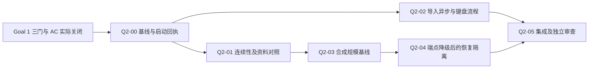

# Goal 2 规划（Goal 1 关闭后启动）

> **当前状态：Q2-00 正式启动未获证；按 D68 先执行独立质量预备支线。** 2026-09-25 按长期目标细化。Goal 1 的关闭以 [ACCEPTANCE.md](ACCEPTANCE.md)、[STATUS.md](STATUS.md) 和同一源码提交的实际门禁为准；本文件不宣布 Goal 1 通过，也不把已有 Windows 绿灯扩展到当前工作区。执行者按下列勾选步骤派工；多 agent 实现时采用 `subagent-driven-development` 的逐包实现与独立审查方式，但本文件的范围、文件 ownership 与启动门优先。

**目标：** 在 v0.1 已有功能内，建立可复现的连续使用、个性化对照、状态恢复与规模证据；修复其中实际复现的缺陷，得到可以结束的一轮质量增量。

**架构：** 保持 Rust 领域模块、`soulcore::commands::Session`、Tauri 薄桥与 React 页面这条路径。新增验证优先放独立测试文件；只有失败用例证明现有承诺被破坏时，才在对应领域模块做最小修复。

**技术栈：** Rust 1.83、SQLCipher、Tauri 2、React/TypeScript、Vitest；沿用 Cargo/pnpm 锁文件与现有本地门禁。

## 1. 范围与首波终点

长期三个目标——个人数字分身、面向用户的产品、行为建模研究——见 [ROADMAP.md](ROADMAP.md)。本轮是它们共享的可信基础，不把远期功能提前塞进 v0.1。

- 唯一产品权威仍是 `PRODUCT_LOCK.md`；算法权威仍是 `docs/algorithms/DECISION.md`。本轮不解冻 T4D/A0/A2、不修改算法阈值、不改 schema、不加 IPC 命令、不改 WP01–WP13 或 AC 矩阵。
- 自传记忆检索、自动记忆提取、情境人格、文件执行与撤销、多端同步、研究导出、账号/API key 管理均不在本轮。它们尚未实现不等于 v0.1 缺陷。
- 验证只用仓库现有合成 fixture 或新生成的合成数据，测试目录用 `tempfile`，模型端点只用本进程绑定的 loopback mock；不读取个人真实档案、不发送真实内容、不加遥测、不把测试输出接进研究导出。
- 未测指标写 `未测`，没有报告写 `无证据`；不得写成 0 或 PASS。目标数值若另设，标 `ASSUMPTION：工程验收预算`，不得当成人格/图谱算法常量。
- 不为证明活动而改代码。已有测试完全覆盖时引用它；新增测试应验证新的组合、状态顺序或规模。无缺陷可交“已验证，无产品修改”。
- 本轮起点快照中，安装脚本及其测试有其他任务的四项未提交修改；规划期间该工作流已将它们提交为 `95ff7d6`。本规划没有修改或验收这四项，`e2fdf16` 的旧门禁不覆盖后续产品变更。执行时重查 `git status`、源码提交与门禁归属，保留并隔离他人工作，不暂存、不还原。

**本轮结束条件：** Q2-00 至 Q2-05 各有实际回执；四个验证包（01–04）完成或由 reviewer 依据已有覆盖判定“不需新增”；本轮发现且属于已有 v0.1 承诺的阻断缺陷为零；同一集成源码提交的 G-L/G-W 与受影响 G-M 完成。若缺陷需要解冻产品边界，则记录成 ROADMAP 决策项，不能以偷偷加功能结案。其他长期方向留到下一轮，首波不会因为未来路线还有任务而永久开放。

> **2026-09-25 执行顺序调整（D68）：** 用户要求记录并跳过受阻真实 NSIS 验证、继续其他部分。允许以已提交源码建立隔离工作树，提前完成 01–04 的覆盖差集、合成验证和已复现 v0.1 缺陷的最小修复，并逐包独立审查；本轮结果称独立质量预备支线，不签发 Q2-00、不写 Goal 1/Goal 2 已关闭。以下正式启动与最终关闭条件继续保留；预备支线不用伪造通过行来启动。Linux 仍暂缓、真实安装本轮 NOT RUN、人工不代勾，不推送或合并。当前规划未提交改动保持原属，由 A0 只追加本次范围及结果。

## 2. 启动条件：原三条硬门，加实际 G-M 核验

保留原来的三条：

1. `STATUS.md` 有独立一行 `Goal 1 已关闭 @ <sha7>`，指向实际验收的源码提交，而非后来写记录的文档提交。
2. **同一 sha** 的 G-L 与 G-W 记录均存在，明确通过，命令完整执行且退出码为 0；只有文件、旧 SHA、跳过、未运行、日志丢失均不算通过。
3. `STATUS.md` 有独立一行 `ACCEPTANCE 全部 v0.1 行通过`。

同时核对 G-M：Windows 记录必须指向相同源码构建的安装包与 headless，含产物哈希；`scripts/author-manual-checklist.md` 的 **0–7 节**逐项写实际观察。0 节是打包证据，1–7 节不能由源码检查、manifest 或 headless 测试替代。8–10 节仍是可选，不新增成关闭门；若实际执行失败，必须记录并判断是否违反已有 AC，不能把已知失败删除。

### 可复制的 PowerShell 预检

在仓库根、`pwsh` 内执行。此脚本只读，不运行 Linux 门禁、不安装软件、不写关闭结论。为避免自然语言中的历史绿灯误匹配，关闭时由协调者在**已验证的两份门禁记录末尾**各补一段 `## Goal 1 关闭摘要`：

- 两份摘要均写 `SOURCE_SHA: <40位提交>`、`G-L: PASS; exit=0` 或 `G-W: PASS; exit=0`、`原始日志已复核: 是`，并链接实际日志/结果表。
- Windows 摘要另逐行写 `G-M-0: PASS | <实际证据>` 至 `G-M-7: PASS | <实际观察>`，以及 `ARTIFACT_SHA256: <64位哈希>`。这些是既有验收的机器可读抄录，不是新增产品验收条款；不得先填 PASS 再去测。

```pwsh
$ErrorActionPreference = 'Stop'
$dirty = @(git status --porcelain)
if ($LASTEXITCODE -ne 0) { throw 'git status 失败' }
if ($dirty.Count -ne 0) { throw '工作区不干净：先隔离已有工作，不能启动实现' }
$statusText = Get-Content -LiteralPath 'docs/STATUS.md' -Raw -Encoding UTF8
$closures = [regex]::Matches($statusText, '(?m)^Goal 1 已关闭 @ ([0-9a-f]{7})\s*$')
if ($closures.Count -ne 1) { throw '需要唯一、独立的 Goal 1 关闭行' }
$sourceShort = $closures[0].Groups[1].Value
$sourceFull = (git rev-parse --verify "$sourceShort^{commit}").Trim()
if ($LASTEXITCODE -ne 0 -or $sourceFull -notmatch '^[0-9a-f]{40}$') { throw '关闭提交无法解析' }
$baselineFull = (git rev-parse --verify 'HEAD^{commit}').Trim()
if ($LASTEXITCODE -ne 0 -or $baselineFull -notmatch '^[0-9a-f]{40}$') { throw '实现基线无法解析' }
if ($statusText -notmatch '(?m)^ACCEPTANCE 全部 v0\.1 行通过\s*$') { throw '缺 AC 通过行' }
$sourcePaths = @('crates', 'apps', 'fixtures', 'scripts', 'Cargo.toml', 'Cargo.lock',
    'package.json', 'pnpm-lock.yaml', 'pnpm-workspace.yaml', 'justfile', 'deny.toml',
    'rust-toolchain.toml', 'docs/schemas', 'docs/algorithms',
    ':(exclude)scripts/author-manual-checklist.md')
git diff --quiet $sourceFull HEAD -- @sourcePaths
if ($LASTEXITCODE -ne 0) { throw 'HEAD 产品/契约内容不同于关闭提交，先重新确认启动基线' }
foreach ($platform in @('linux', 'win')) {
    $records = @(Get-ChildItem -LiteralPath 'docs/gates' -File |
        Where-Object { $_.Name -match "^\d{8}-$sourceShort-$platform\.md$" })
    if ($records.Count -ne 1) { throw "缺少或存在多份 $platform 同 SHA 记录" }
    $record = Get-Content -LiteralPath $records[0].FullName -Raw -Encoding UTF8
    $summary = [regex]::Match($record, '(?ms)^## Goal 1 关闭摘要\s*\r?\n(?<body>.*?)(?=^## |\z)')
    if (-not $summary.Success) { throw "$platform 缺已复核的关闭摘要" }
    $body = $summary.Groups['body'].Value
    if ($body -notmatch "(?m)^SOURCE_SHA: $sourceFull\s*$") { throw "$platform 源码 SHA 不同" }
    $gateName = if ($platform -eq 'linux') { 'G-L' } else { 'G-W' }
    if ($body -notmatch "(?m)^${gateName}: PASS; exit=0\s*$") { throw "$gateName 未明确通过" }
    if ($body -notmatch '(?m)^原始日志已复核: 是\s*$') { throw "$gateName 未复核原始证据" }
    if ($platform -eq 'win') {
        if ($body -notmatch '(?m)^ARTIFACT_SHA256: [0-9a-fA-F]{64}\s*$') { throw '缺安装包哈希' }
        foreach ($section in 0..7) {
            $line = [regex]::Match($body, "(?m)^G-M-${section}: PASS \| ([^\r\n]+)$")
            if (-not $line.Success) { throw "G-M-$section 缺通过与实际观察" }
            if ($line.Groups[1].Value -match '待做|待观察|未执行|跳过|无证据|TODO|TBD|<|>') {
                throw "G-M-$section 仍是占位或未完成"
            }
        }
    }
}
Write-Output "PRECHECK ONLY: 验证源码=$sourceFull；实现基线=$baselineFull；记录结构通过，仍须 A0 + reviewer 核对证据后签发启动回执。"
```

机器 diff 只排除 `scripts/author-manual-checklist.md`，允许在已测源码之后补录观察，不排除其他脚本。A0 与 reviewer 必须逐行核对这份清单的差异：只有实际观察/证据补录可以豁免；若改了测试要求、操作步骤或通过条件，不能按文档补录放行，须重新确认相应验收。`docs/gates/` 与状态文档的补录同样不能改变被测源码。

文本可以写错，所以预检通过**不自动授权实现**。A0 与独立 reviewer 还必须核对原始退出码、完整结果表、日志存在性/哈希、G-M 作者实际观察、打包前后产物及同源码关联，然后在本文件 Q2-00 回执中分别记录“Goal 1 验证源码：<source-full-sha>”“实现基线：<baseline-full-sha>”和“启动复核：PASS @ <baseline-full-sha>”。后者是包含最新计划与关闭证据的干净提交；两者仅允许经审查的文档/证据差异，产品与契约内容必须通过上述比对。缺证据就保持 BLOCKED，不补写想象的结果。目前 G-L 暂缓与 G-M 未完成并不因本规划而解除。

## 3. 已有接线与并行边界

| 层 | 已存在路径与接口 | 本轮注意事项 |
|---|---|---|
| 数据边界 | `crates/soul-store-api/src/lib.rs` 的 `ProfileStore` / `MemoryStore` / `GraphStore` / `BlobStore`；`forget.rs` 的 `ForgetOps`；`research.rs` 的 `ResearchPreview` | domain 不直接开数据库；研究接口独立于可写 store，预览不导出 |
| 领域 | `soul-profile::{profile_view, correct_axis, set_voice}`、`soul-memory::{create, read, update, forget}`、`soul-graph::{rebuild, correct_tie, release_tie}`、`soul-draft::ProfileBrief` | 已有可纠正档案、语气锁、图谱与记忆 CRUD；不能把这些列成待开发能力 |
| 组合根 | `crates/soulcore/src/commands/session.rs` 的 `Session` | 单一 store；导入/问卷有事务；档案已进入起草；此文件必须单 owner |
| 桌面薄桥 | `apps/desktop/src-tauri/src/commands.rs` 的 `SessionState(Mutex<Session>)`，`src/lib.rs::configure` | 共享会话与命令注册；root workspace 测试不含独立桌面 workspace |
| 前端 | `apps/desktop/src/core.ts` 的 invoke/types → `src/routes/` | `core.ts` 唯一直接使用 Tauri API；UI 不增加业务推理或网络路径 |
| 验证工具 | `soul-testkit::{fixtures, MockLlm, LeakageChecker}`；`crates/xtask/src/{schema_freeze,egress,denylist}.rs` | testkit 不进入正常产品依赖；xtask 已覆盖冻结/网络/禁词，不重复造门 |

未来插入点仅用于避免当前走死：记忆检索应从 `MemoryStore`/`BlobStore` 加新的受控领域服务；情境模型从 `ProfileView` 到 `ProfileBrief` 的映射演进；可逆执行从当前只拒绝的 `soul-fileplan/src/execute.rs` 另立 v0.1.1 事务设计；多端适配在 `Session` 外，密钥迁移与同步协议须先立契约；研究服务继续隔离于助手执行。这些都不在 Q2 实现。

**串行瓶颈：** `SessionState` 在同步调用期间持会话锁，部分 E1/图谱读路径还持 store guard；`Session`、桥接类型、`fakeCore.ts`、`ipc_roundtrip.rs`、锁文件和权威文档易冲突。先测真实影响，不因文件大就拆架构，也不以性能名义并行打开第二份 SQLCipher。

## 4. 四个 agent 的推进方法

总并发最多四个：A0 协调/集成、A1 核心验证、A2 界面验证、A3 独立 reviewer。**同时最多两条实现线。** A0 可以整理基线与文档，但不能在 A1/A2 正在写的文件上同时修改；A3 只读，不能边写边给自己的改动签 PASS。

| Owner | 可写路径 | 必须交协调者的变更 |
|---|---|---|
| A1 | 每包明确新增的 `crates/soulcore/tests/q2_*.rs`；经派工点名的单个领域实现文件 | `Session`、store traits/schema、workspace manifest 与所有共享文件 |
| A2 | `apps/desktop/src/routes/Import.tsx`、`Import.test.tsx`、拟新增 `Import.race.test.tsx` | `core.ts`、`fakeCore.ts`、共享组件/styles、任何新依赖/命令 |
| A0 | `session.rs`、两侧 bridge/注册、`ipc_roundtrip.rs`、`fakeCore.ts`、Cargo/pnpm 锁、`xtask`、规划/状态/门禁记录 | 改前通知两实现线并暂停受影响消费方；该轮必须独立 review |
| A3 | 无产品写权限；只在任务回执里提供 findings | 所有实现交原 owner 修复后重新审查 |

同一个 core owner 可依次执行 Q2-01 → Q2-03 → Q2-04；A2 独立完成 Q2-02 后退出或转只读验证，不继续扩任务。每包使用从 A0 冻结基线创建的 `codex/q2-xx-*` 隔离 worktree；各自独立 target 目录，不共享可写构建缓存。当前 dirty tree 不做 `reset` / `clean` / `stash`，不使用 `git add .`；由其所属任务处理完成后再冻结基线。无 worktree 条件时退回串行，不能在一个文件里“各改一半”。

DAG（箭头表示必须完成并交付）：



01→03→04 的串行来自同一核心 owner 与测量资源预算，并非产品语义必须如此；以后人员改变仍不得超过两条实现线。

## 5. 首波工作包

估算为**相对工作量**：S≈半天至一天有效工作、M≈一至三天；只用于切包，不是交付日期。首次原生依赖编译、门禁主机排队与作者 G-M 等待另算。所有命令在 `pwsh` 内；原生程序每次显式检查 `$LASTEXITCODE`。新测试文件的命令只能在文件已创建后运行，不能把找不到 target 当作预期红灯。

### Q2-00：固定关闭凭据与可比较基线

**优先级 / owner / 依赖 / 估算：** P0；A0 + A3；Goal 1 实际关闭；S。

**文件：** 读取既有 `STATUS.md`、`ACCEPTANCE.md`、`gates/README.md`、同 SHA 的两份门禁与 `scripts/author-manual-checklist.md`；A0 只在现有门禁补关闭摘要、在本文件追加本轮回执。测量原始日志允许落忽略的 `target/q2/`，正式结论仍写规划/门禁，不新建开发流程文档或 `.agent_workspace`。

**Consume → produce：** 消费已提交源码 SHA、G-L/G-W 退出码与 G-M 观察；产出验证源码 SHA、包含最新计划/证据的实现基线 SHA、启动复核结果、命令/版本/fixture SHA-256、01–04 覆盖差集。它不是新的 Rust/IPC API。

- [ ] 运行上面的只读预检；失败即停止实现，但可以继续记录缺失的证据。
- [ ] A3 对照原始日志与作者观察复核每个 PASS；记录现有源码是否包含此前 dirty 修改，禁止用 `e2fdf16` 的证据证明其后产品变更。
- [ ] 列出现有测试覆盖：`session_screens` / `session_tie_lock` / `session_projection` / `session_crash` / `session_matrix_replay` / `session_e1` / `session_research` / Import UI。
- [ ] 每条拟新增断言标“现有已覆盖”或“新增组合”；同等覆盖则删掉计划中的重复测试，记录引用。
- [ ] 冻结基线与文件 ownership，签发 A1/A2 的独立任务输入；未签发前都不能写产品实现。

**验收：** 缺失、失败、同 SHA 不一致、未测人工项均能阻断；原三条硬门与 G-M 不被新文档豁免。规模/体验/效用基线此时允许“未测”，不能编造数值。

### Q2-01：跨重启连续性与合成个性化对照

**优先级 / owner / 依赖 / 估算：** P1；A1；Q2-00；M。

**文件：** 拟新增 `crates/soulcore/tests/q2_continuity.rs`；读取既有 `session_screens.rs`、`session_tie_lock.rs`、`session_projection.rs`、`crates/soul-profile/src/{service,view,voice}.rs`、`crates/soul-draft/src/{brief,template}.rs`。只有复现违约才由 A0 批准修改具体领域文件；`session.rs` 仍 A0 独占。

**真实接口：** `Session::open(path) -> Session`；`set_voice(&mut self, field: &str, option: &str) -> Result<ProfileScreen, SessionRefusal>`；`draft_pasted(&mut self, &str) -> Result<DraftValue, SessionRefusal>`；`profile()`、`correct_axis()`、`correct_tie()`、`release_tie()`。领域对照用现有 `ProfileBrief::neutral()`、`ProfileBrief::from_view(&ProfileView)`、`soul_draft::render_template(&ProfileBrief, TemplateContext)`。Produce 为测试/回放结果，不新增产品功能。

**代表性完整测试起点（拟新增，尚未执行）：**

```rust
use soulcore::commands::session::Session;

#[test]
fn voice_changes_survive_reopens_without_changing_a_control_profile() {
    let owner = tempfile::tempdir().expect("owner temp directory");
    let control = tempfile::tempdir().expect("control temp directory");
    let paste = "合成材料：下周再确认这个安排。";
    let mut neutral = Session::open(control.path());
    let baseline = neutral.draft_pasted(paste).expect("neutral draft").text;
    for (setting, expected) in [
        ("warm", "先谢谢你专门说一声。"),
        ("cool", "直接说重点。"),
        ("warm", "先谢谢你专门说一声。"),
    ] {
        let mut session = Session::open(owner.path());
        session.set_voice("warmth", setting).expect("set voice");
        drop(session);
        let mut reopened = Session::open(owner.path());
        let output = reopened.draft_pasted(paste).expect("reopened draft");
        assert!(output.text.contains(expected));
        assert_ne!(output.text, baseline);
        assert!(reopened.audit().expect("audit").verified);
        assert!(!reopened.snapshot().llm_endpoint_configured);
        assert!(!reopened.collect_status().consent_granted);
        assert_eq!(neutral.draft_pasted(paste).expect("control draft").text, baseline);
    }
}
```

- [ ] 先对照 `session_screens` 已有 warm/cool 用例；保留这里“多次重开＋再次改值＋独立对照库”的新增性质，不能另抄一遍单次语气测试。
- [ ] 在同文件加入固定合成档案集合的三路对照：`neutral()`、`from_view()`、以相同公开 `VoiceSetting` 手工构建的参考 brief；四项语气逐项与组合各有确定期望。
- [ ] 断言资料路径与手工参考在 `render_template` 输出一致、改变无关合成记忆不会影响当前仅消费档案的模板、未回答轴保持 unknown；不能把这写成“真实用户更满意”或“记忆被检索”。
- [ ] 连续轨迹补一条已有图谱纠正→重开→新合成导入触发 rebuild→用户档仍生效→release→机器档重新生效；仅补现有文件没有覆盖的状态顺序，不重写 T4D 算术。
- [ ] 运行新增与关联测试；若首跑已绿，仅交覆盖/基线；若失败，先保存最小反例，由协调者指定单一修复 owner，红→最小修复→绿。

```pwsh
$ErrorActionPreference = 'Stop'
cargo test -p soulcore --test q2_continuity --locked
if ($LASTEXITCODE -ne 0) { throw 'Q2-01 新测试失败' }
cargo test -p soulcore --test session_screens --test session_tie_lock --test session_projection --locked
if ($LASTEXITCODE -ne 0) { throw 'Q2-01 相关回归失败' }
cargo test -p soul-draft --test voice_and_template --locked
if ($LASTEXITCODE -ne 0) { throw '语气领域回归失败' }
```

**Fixtures / 产物 / 验收：** 复用 `fixtures/import/soul-import-v1/three_partners.jsonl`；资料与正文用测试内合成常量。产出三路对照表和轨迹断言结果。资料/参考一致是接线正确性证据，不是人格科学有效性或商业留存证据；真实用户效用验证留给 ROADMAP 的 VAL-02/03。

### Q2-02：导入页异步结果与键盘流程

**优先级 / owner / 依赖 / 估算：** P1；A2；Q2-00，可与 Q2-01 并行；S–M。

**文件：** 已有 `apps/desktop/src/routes/Import.tsx`、`Import.test.tsx`；拟新增 `Import.race.test.tsx`。只读 `src/core.ts`、`src/test/fakeCore.ts`；如测试双需要扩展，A0 单独审查并修改，不能将两个 worker 的改动混在共享 fake 中。

**Consume → produce：** 消费现有 `previewSoulImportV1(text)` / `previewTelegram(text)` 返回的 `Promise<ImportPreview>` 及相应 commit 函数。Produce 是当前页面对应的预览/回执/错误状态；不新增 command、格式或采集。新测试辅助类型仅限该测试文件：

```typescript
interface Deferred<T> {
  readonly promise: Promise<T>;
  resolve(value: T): void;
  reject(reason: unknown): void;
}
function deferred<T>(): Deferred<T> {
  let resolve!: (value: T) => void;
  let reject!: (reason: unknown) => void;
  const promise = new Promise<T>((ok, fail) => { resolve = ok; reject = fail; });
  return { promise, resolve, reject };
}
```

**现有证据→待证问题：** `Import.tsx::read` 的两层 Promise 写共享页面状态；文件输入在 busy 时禁用，格式 radio 未禁用。这里有旧响应与当前格式错配的候选路径，尚未执行复现，不能写成已确认缺陷。

- [ ] 用局部 `vi.mock('../core', ...)` 与上述 Deferred 控制两个格式预览的 resolve/reject 顺序，保持真实 `ImportPreview` 类型；不要依赖 sleep 或猜测时间。
- [ ] 按“上传 JSONL，预览 pending，切到 Telegram，旧预览 resolve”顺序复现。断言旧来源不会成为当前格式可提交的预览、不会调用任一 commit；若实现选择 busy 时禁用切换，断言 radio 确实不能切换且提交仍对应原文件。
- [ ] 补失败→重新选择→成功，旧 reject 不覆盖新成功；取消/换文件后不恢复旧预览，快速重复确认只产生一次 commit。已有用例若覆盖就引用，不增加同义测试。
- [ ] 用 `userEvent.tab()`、label/role 验证只靠键盘可以选格式、取消、确认，busy 状态有可读说明；仅修实际焦点或读屏问题，不重做样式/布局。
- [ ] 若红，最小修复选“禁用冲突操作”或“请求代次校验”之一，保留现有 DOM 结构；若全绿，只交现有保护与新增反例证据。

```pwsh
$ErrorActionPreference = 'Stop'
$previousNodeEnv = $env:NODE_ENV
try {
    $env:NODE_ENV = 'test'
    pnpm --filter @soul/desktop exec vitest run src/routes/Import.test.tsx src/routes/Import.race.test.tsx --maxWorkers 2
    if ($LASTEXITCODE -ne 0) { throw 'Q2-02 页面测试失败' }
    pnpm --filter @soul/desktop lint
    if ($LASTEXITCODE -ne 0) { throw '前端类型或 lint 失败' }
} finally {
    $env:NODE_ENV = $previousNodeEnv
}
```

**Fixtures / 产物 / 验收：** 使用现有 `fixtures/import/{soul-import-v1/valid_basic.jsonl,telegram/result_basic.json}`，不显示其中正文。每种异步次序都有对应调用次数与 DOM 断言；错误不残留、无多余写入、禁用期间不提交。UI mock 证明状态机，不能替代真实 IPC；A0 在 Q2-05 判断是否需要最小 IPC 补证。

### Q2-03：导入、图谱与读取的合成规模基线

**优先级 / owner / 依赖 / 估算：** P2；A1；Q2-01；M。

**文件：** 拟新增 `crates/soulcore/tests/q2_scale.rs`；读取 `crates/soul-import/src/commit.rs`、`crates/soul-graph/src/build.rs`、`crates/soul-store/src/`；若未来需要复用生成器再由 A0 批准放进 `soul-testkit`，首波不用为一份测试扩展共享 crate。

**真实接口：** `Session::preview_soul_import_v1(&self, text: &str)`、`commit_soul_import_v1(&mut self, text: &str)`、`people(&self)`、`profile(&self)`、`memories(&self)`、`research(&self)`、`audit(&self)`；生成器输出合规 JSONL 字符串。Produce 是测试内 `ScaleSample` 与本地报告，不是新增产品 API：

```rust
#[derive(Debug, serde::Serialize)]
struct ScaleSample {
    source_sha: String,
    fixture_sha256: String,
    scenario: String,
    messages: usize,
    peers: usize,
    trial: usize,
    elapsed_micros: u128,
    event_count: usize,
    tie_count: usize,
    audit_verified: bool,
}
```

- [ ] 先用 100 条、10 个合成人校验生成器：固定时间与 id、明确 self/third_party、每个对话仅两方；在一个新临时库导入一次，不把同文件重复导入当去重测试。
- [ ] 依次对 1,000 / 10,000 条、10 / 100 个 peer 做预览、提交、图谱与档案/研究读取，规模是**测量计划**，不是产品承诺。每个样本独立 temp 库，记录机器、缓存、构建 profile、试次、各阶段耗时和计数。
- [ ] 每个规模先热身一次，再独立测 5 次，报告原始样本、min/median/max；不把 5 次估计包装成可靠 p95，也不与不同硬件/编译模式混比。
- [ ] 普通测试只跑 100 条正确性；重测量入口可用 `#[ignore = "local synthetic scale measurement"]` 显式启动，01–04 回执必须列明该项实际是否运行。
- [ ] 断言消息/边数符合生成器、审计链 verified、第三方研究行零且排除计数非零、预览 `written_to_disk=false`；默认测试不能用机器相关绝对耗时做门槛。
- [ ] 只对测得瓶颈提出一个最小优化候选。未知基线不预设 0、不先拆 Session、不加索引/schema 或线程池；需要此类设计的优化移入后续决策。

```pwsh
$ErrorActionPreference = 'Stop'
cargo test -p soulcore --test q2_scale --locked
if ($LASTEXITCODE -ne 0) { throw 'Q2-03 规模生成与正确性失败' }
cargo test -p soulcore --test q2_scale --locked -- --ignored --nocapture --test-threads=1
if ($LASTEXITCODE -ne 0) { throw 'Q2-03 显式规模测量失败' }
cargo test -p soul-testkit --test fixture_corpus --locked
if ($LASTEXITCODE -ne 0) { throw '既有 fixture 契约失败' }
```

**与已有测试区别：** `session_import` 已证明事务、重导后匹配联系人；它明确不承诺消息去重。`events_by_source_index` 已有索引回归，本包不重写索引；只补同一版本规模证据。采集/网络监控不同时跑，避免把测试竞争误当产品性能。

**验收：** 结果可从同 SHA、同生成参数重测；数量断言全部通过；性能实际值已报告但没有硬件外推。无确认瓶颈则无性能产品修改。原始报告仅含合成计数/时间/哈希，不含真实内容。

### Q2-04：E1 降级后恢复与会话隔离的组合验证

**优先级 / owner / 依赖 / 估算：** P1；A1；Q2-03（资源串行）；S–M。

**文件：** 拟新增 `crates/soulcore/tests/q2_recovery.rs`；只读既有 `session_e1.rs`、`session_research.rs`、`session_crash.rs`、`crates/soul-draft/tests/`、`crates/soul-egress/tests/e1_origin.rs`。只有复现违约时按 A0 批准的具体实现路径修复；不扩 `MockLlm` 以模拟当前包不需要的协议。

**真实接口：** `MockLlm::{start, set_reply, set_redirect, clear_redirect, request_count, requests}`；`Session::{set_user_endpoint, prepare_draft, generate_draft, clear_user_endpoint, draft_pasted, research, audit}`；`soulcore::commands::draft::Approval { preparation_id, plan_hash }`。Produce 为组合测试与脱敏断言，不新增可调用功能。

**代表性测试主体（放入新文件并导入 `Session`、`MockLlm`、`Approval`，拟新增未执行）：**

```rust
use soul_testkit::MockLlm;
use soulcore::commands::draft::Approval;
use soulcore::commands::session::Session;

#[test]
fn an_empty_reply_then_a_good_reply_do_not_poison_the_next_preparation() {
    let dir = tempfile::tempdir().expect("temporary store");
    let mock = MockLlm::start().expect("loopback mock");
    let mut session = Session::open(dir.path());
    session.set_user_endpoint(&mock.base_url()).expect("endpoint");
    for reply in ["", "这是合成端点的正常回复。"] {
        mock.set_reply(reply);
        let plan = session.prepare_draft("合成的待回复材料", None).expect("prepare");
        let approval = Approval {
            preparation_id: plan.preparation_id,
            plan_hash: plan.plan_hash,
        };
        let draft = session.generate_draft(&approval).expect("draft or fallback");
        assert_eq!(draft.degraded.is_some(), reply.is_empty());
        assert!(session.generate_draft(&approval).is_err());
    }
    assert_eq!(mock.request_count(), 2);
    assert!(session.audit().expect("audit").verified);
    drop(session);
    let mut reopened = Session::open(dir.path());
    assert!(!reopened.snapshot().llm_endpoint_configured);
    assert!(reopened.draft_pasted("另一段合成材料").is_ok());
    assert_eq!(mock.request_count(), 2);
}
```

- [ ] 先确认 `session_e1` 的 empty/clinical/replay/clear 场景与 egress 的 response-cap/timeout 覆盖，保留“失败后下一次有效请求＋重开回关”的差集；不要再测一遍单次重定向。
- [ ] 加同会话“cross-origin 拒绝→clear_redirect→重新准备成功”序列，第二台 mock 始终 0 请求；序列间读取研究预览并确认没有被请求或错误变成研究导出。
- [ ] 输入混合现有 Unicode identifier fixture 与普通合成文字；检查实际 `RecordedRequest.body`、审核视图、拒绝回包分别满足其既有占位/无正文契约，不用 UI mock 代替 wire 检查。
- [ ] 对照独立 Session 的 endpoint、prepare、同意均不串到另一个临时库；重启前后审计链连续可验证，研究 `written_to_disk=false` 与排除计数保持其真实语义。
- [ ] 保存结果；若已被既有覆盖完全包含则 no-change 回执。不为造“红”修改 fixture 期望或放宽 denylist。

```pwsh
$ErrorActionPreference = 'Stop'
cargo test -p soulcore --test q2_recovery --test session_e1 --test session_research --locked
if ($LASTEXITCODE -ne 0) { throw 'Q2-04 恢复或隔离回归失败' }
cargo test -p soul-egress --test e1_origin --locked
if ($LASTEXITCODE -ne 0) { throw '既有 E1 边界回归失败' }
```

**验收：** 空回复降级不会污染下一次有效请求；失败不赋予新权限、旧批准不重放、不同 Session 不共享端点；异常后的链与研究预览仍满足既有契约。网络故障与隐私保证依据各测试断言报告，不笼统声称“所有故障恢复完成”。

### Q2-05：集成、独立 review 与首波关闭

**优先级 / owner / 依赖 / 估算：** P0；A0 集成、A3 审查；01–04 实际回执；M 加门禁等待。

**文件：** 按任务差异集成；A0 如有必要单独修改 `session.rs`、bridge 与 `ipc_roundtrip.rs`；在 `docs/gates/` 留同源码正式记录，更新本文件结果及 `STATUS.md` 当前状态。产品锁/AC/冻结算法不改，ROADMAP 只回写本波学到的证据与下一轮优先级。

**Consume → produce：** 消费每包基线、文件清单、命令退出码、反例、修复与 no-change 结果；产出集成源码 SHA、独立审查结论、两平台证据、受影响人工项与关闭/阻断结论。

- [ ] reviewer 逐包先审任务符合性，再审实现；确认没有共享文件越权、测试只验证 mock 自己、fixture 泄漏、用未知值代替 0、把研究样本写成用户导出等问题。
- [ ] A0 顺序集成；每次读取实际 diff，不让 agent 自动接受冲突。共享文件如变化先重跑真实 IPC 的对应命令，再跑命令面与单 store 断言。
- [ ] 保持冻结 schema/算法/命令面，执行下面的本机检查；未成功不进入固定提交门禁。
- [ ] 冻结集成源码后按既有入口分别跑 G-W 与 G-L；本文件只给 Windows 命令，Linux 仍由指定 Linux 机执行 `just ci-full`，不能在 Windows 写“Linux 通过”。
- [ ] 如页面或产品行为改变，完成受影响 G-M；如仅新增独立测试/证据，reviewer 说明未触发哪些人工重测以及依据。Goal 1 原始 G-M 不能被豁免。
- [ ] 确认源码 SHA 与记录相符后写“首波完成”或具体 BLOCKED；将尚未批准的大功能放远期队列，不延长本波。

```pwsh
$ErrorActionPreference = 'Stop'
cargo fmt --all -- --check
if ($LASTEXITCODE -ne 0) { throw 'Rust 格式失败' }
cargo run -p xtask --locked -- all
if ($LASTEXITCODE -ne 0) { throw '冻结/网络/禁词门失败' }
cargo test --manifest-path apps/desktop/src-tauri/Cargo.toml --locked --test ipc_roundtrip --test command_surface --test one_store
if ($LASTEXITCODE -ne 0) { throw '桌面真实桥接回归失败' }
$previousNodeEnv = $env:NODE_ENV
try {
    $env:NODE_ENV = 'test'
    pnpm --filter @soul/desktop exec vitest run --maxWorkers 2
    if ($LASTEXITCODE -ne 0) { throw '前端全量回归失败' }
} finally {
    $env:NODE_ENV = $previousNodeEnv
}
# 仅在集成源码提交固定、工作树干净且工具链准备好后执行完整 G-W。
pwsh -NoProfile -File scripts/gate-win.ps1
if ($LASTEXITCODE -ne 0) { throw 'G-W 失败，不能写通过' }
```

**失败规则：** 真正失败保持红，修后按影响重测；日志缺失或主机不可用标 BLOCKED；测试未跑标 NOT RUN；不把一次定向测试绿写成全量门禁绿。不使用 `git commit --amend` 改掉已测源码然后沿用原 SHA 记录。

### VAL-01 评测适配交接（非 Q2 关闭包）

**状态：DESIGN READY / EXECUTION BLOCKED_BY_GOAL1_AND_Q2-00。** 本节不是 Q2-06，不改变 Q2-00–05 的关闭条件，也不启动 VAL-02、VAL-03 或真实用户试验。

**Consume → produce：** 未来只消费 [ROADMAP 7.2 的三类任务、A/B/C、反馈字段和指标登记](ROADMAP.md#72-首轮个性化试验)，以及现有 `ProfileBrief::neutral()`、`ProfileBrief::from_view()`、手工 brief Rust API、本机模板和两条 endpoint 路径；产出合成评测适配、预注册配对槽位和可回放的脱敏汇总。Q2-01 只作为 brief 接线/连续性准备证据，不作为效用结果。

**进入条件：** Goal 1 以 ACCEPTANCE/STATUS 实际关闭；Q2-00 签发可比较实现输入；形成可用构建。真实作者或志愿者阶段另需主动产品评测同意、开始/截止时间、撤回说明和逐次 endpoint 授权。任一条件缺失保持 NOT STARTED。

**允许范围：** Q2-00 后先做覆盖差集，再由 A0 指定 `crates/soul-draft/tests/`、`crates/soulcore/tests/` 或专用合成 fixture 的最小写路径。只允许测试/离线评测代码；不新增产品 UI、IPC、schema、产品表、遥测、研究导出、网络权限或新的 gate/baseline/hash。

- [ ] 用合成输入证明 A/B/C 实际 brief 被构造；B 构造失败必须显式失败，不能沿用 Session 的 neutral 回退仍标 B；T1 voice 相同或运行条件不一致时，Pair 的 `comparability_status` 必须记录 `not_comparable`。
- [ ] 分别覆盖 T1 本机语气骨架、T2 默认占位端点、T3 一次性原文端点；loopback 只验证适配和字段口径，不填写真人偏好。
- [ ] 固定 AB/AC/BC 槽位、左右 variant/种子、任务类型、模型/版本和缺失规则；能够从 Pair/Candidate 字段（含 `comparability_status`）重算 assigned→started→generated→rated→completed 漏斗及各指标分母，并从匿名单参与者 Run 的 `consent_state` 单列 withdrawn 数量。
- [ ] 证明拒绝、降级、未配置 endpoint、审批不匹配和安全暂停不会被计成正常端点胜负；原始 prompt、候选正文和编辑后正文不进入仓库回执。
- [ ] 按第 6 节回执字段记录实际命令、退出码、合成样本数、未跑项、数据边界和独立审查；真实试验开始前另写匿名/汇总 consent 回执，只记录 `consent_state`、开始/截止日期和撤回数量，不保存姓名、签名或原始同意文本。该回执不是 gate。

**当前验证：NOT RUN。** 本次只定义交接；没有新增适配代码、没有运行模型、没有生成反馈样本。未来若无法保持条件可比、盲法或最小数据边界，状态写 BLOCKED/NOT RUN，不通过改产品功能或扩大数据采集绕过。

## 6. 可复制的派工与回执

下面是派工消息内容，不是要新增的流程文件。A0 每次仅派一个包，替换具体 task、基线和允许写路径后发送；所有被替换值必须来自实际 git/read 结果。

> 执行 Q2-01（或已授权的其他单包），基线为本文件 Q2-00 启动回执中的“实现基线”完整 SHA（包含最新计划与证据），不能误用较早的“Goal 1 验证源码”SHA。只写该包列出的独占文件，读取本文件对应接口与断言后先检查覆盖差集。遵守 PRODUCT_LOCK/AC/冻结算法；不加产品能力、不新建流程文档。所有 shell 用 pwsh，首行 `$ErrorActionPreference = 'Stop'`，读写 UTF8，原生退出码显式检查。不要碰他人改动，不改 shared owner 文件；需要共享修改时给 A0 最小补丁建议与失败证据。先保存反例、再最小修复；已有正确行为不改。完成提交前运行所需定向测试，回执写实际命令/退出码/未跑项/差异/风险。不得执行安装卸载、真实用户数据导入或外网端点请求。

每包回执的必填项：

| 字段 | 填写内容 |
|---|---|
| 任务 / 状态 | Q2-xx / VAL-01；READY / RUNNING / REVIEW / DONE / NO-CHANGE / BLOCKED |
| 基线 / 产出 | 完整源码 SHA、分支/worktree、实际变更路径；无代码改动明确写无 |
| 输入证据 | 读取的契约、既有测试、fixture 路径与哈希、覆盖差集 |
| 结果 | 新反例的原始失败、修复后通过；或无缺陷/已有覆盖的理由 |
| 验证 | 每条实际命令、退出码、样本数、日志位置；未跑项目及原因 |
| 数据边界 | 仅合成/临时目录/loopback 是否满足；报告是否含正文或真实数据 |
| 风险 / 下一步 | 具体剩余风险、所需共享改动、是否影响 G-M；无则写无已知阻断项 |
| 独立审查 | reviewer、结论与 findings；作者不能给自己签 PASS |

Q2 回执只进本文件末尾/对应正式门禁记录，由 A0 串行更新。VAL-01 只复用本表字段语义，不新增 Q2 编号；回执只进入本文件的 VAL-01 登记，不进入 `docs/gates/`，也不改变 Q2-00–05 的关闭状态。其他 agent 返回消息，不并行改 `STATUS.md`、`DECISIONS.md`、`PLAN_INDEX.md`、`ROADMAP.md` 或本文件。产品/算法决策需要另立决议并明确下一版，不能借“计划补充”偷改冻结承诺。

## 7. 本轮执行登记

下表保留原规划时点，当前D68预备支线结果以本节后续实际回执为准；正式启动与关闭不由预备支线代替。

| 包 | 状态 | 当前证据 |
|---|---|---|
| Q2-00 | BLOCKED | Goal 1 未关闭；关闭摘要、同 SHA G-L 与实际 G-M 尚未满足 |
| Q2-01 | 未启动 | 仅有计划与待执行测试示例，无新的实测数据 |
| Q2-02 | 未启动 | 导入异步候选路径来自源码阅读，尚未复现，不认定为已确认 bug |
| Q2-03 | 未启动 | 合成规模基线未测 |
| Q2-04 | 未启动 | 恢复组合未执行，既有单场景覆盖不能当作本包已通过 |
| Q2-05 | 未启动 | 依赖前述包与同源码门禁 |

本次规划编辑不运行产品测试、不启动 Goal 2、不修改安装相关工作，也不产生实施提交。

### 2026-09-25：D68 独立质量预备支线

- 用户原话：“记录并跳过这里，继续完成其他部分”。真实 NSIS 临时副本与完整安装验证本轮为用户要求跳过 / NOT RUN，保留首次失败和卸载器残留证据；Linux 暂缓与作者人工缺口不变。
- 预备源码基线：`55d43edd3d5a287939276d16f3efb672fdbc69d5`（产品源码 `95ff7d6`，其后仅收尾文档）；主树既有七项规划改动未重置或纳入代码基线。
- A0 协调并串行编辑共享文档；A1 核心连续性；A2 Import 异步/键盘；A3 独立规格→质量审查。实现文件与独立 worktree/target 在签发任务时登记。
- 前次两个只读分析 agent 遇到 503 / 502 基础设施错误，无代码或验证产出；已改用默认可用路由重新分派。
- 当前预备支线：01–04 DONE，独立集成 G-W/补充检查PASS，集成源码与证据独立规格/质量PASS；原始派工表保留作为时点记录，以后续回执为准。Q2-00 正式启动及 Q2-05 整体关闭缺既定门禁，不声明完成。

预备支线派工（2026-09-25，基线均为 `55d43edd3d5a287939276d16f3efb672fdbc69d5`）：

| Owner | 分支 / worktree | 独占写入与验证资源 | 当前状态 |
|---|---|---|---|
| A1 `/root/core_continuity` | `codex/q2-01-continuity-20260925` / `E:\Project\Soul-q2-01-20260925` | 仅 `crates/soulcore/tests/q2_continuity.rs`；独立 `D:\Soul-q2-core-target-20260925`；拟关 debug 信息和 incremental 以控制空间 | 覆盖差集已交：4 条新增连续轨迹/表驱动测试；先关联基线，未报告产品缺陷 |
| A2 `/root/import_races` | `codex/q2-02-import-20260925` / `E:\Project\Soul-q2-02-20260925` | `Import.tsx` / `Import.test.tsx` / `Import.race.test.tsx`；独立 node_modules 与日志 | 现有 13 例；先 Deferred 反例，再最小修复；未运行前不称竞态已复现 |
| A3 `/root/release_review` | 只读主树及两实现 worktree | 无代码写权限；先规格，后质量 | D68 与跳过记录增量规格 PASS；代码审查待实现结果 |

A1 只加缺失组合；已有 81×2 语气安全测试不重复。A2 先区分 file.text pending 与 preview pending：前者候选错格式提交，后者候选显示旧预览但 text=null，不能等同；如 busy 交互锁消除并发，则以真实不可操作与失败后重选证明，不向禁用输入强派事件制造“旧 reject”。所有首次结果与日志以各 owner 实际回执为准。
独立审查与下一包差集：

- `/root/release_review` 已分别完成 D68/跳过记录五文件增量的规格 PASS、质量 PASS；只审相对 `target/q2/planning-before-skip-20260925` 的本轮增量，不将既有规划内容计为本轮交付。链接/锚点、历史失败和当前 NOT RUN、正式启动与预备范围均核对。
- Q2-03 已有覆盖是小型 session_import fixture 与 400 行索引计划回归，缺少四组 1k/10k × 10/100 peer 的同版分阶段计时。保留 100/10 普通正确性与显式规模测量；不新增索引或消息去重。
- Q2-04 已有单次降级、重定向、replay/clear/restart；egress 层甚至已有 redirect→clear 成功。因此新增只在 Session 层串起恢复、新准备、旧批准拒绝、重开回关与独立 Session，实际 wire/研究/审计断言不能省略。`ImportPreview.writes_anything` 和研究 `written_to_disk` 是不同字段，不混用。
- Q2-02 真实 IPC 已有 `an_export_crosses_the_ipc_as_counts_and_becomes_people`、`a_telegram_export_crosses_the_ipc_as_counts_and_becomes_people` 和参数契约；本轮页面的时序与键盘断言仍由 Deferred UI 测试证明。是否新增 IPC 需看最终 diff，不预设扩大共享文件。
### Q2-02 预备回执（2026-09-25）

- 状态：预备包 DONE；不等于 Q2-00 正式启动或 Q2-05/Goal 1 关闭。
- 基线 `55d43edd3d5a287939276d16f3efb672fdbc69d5`；产出 `ba2607882513d394456bc06afd168e5cb94ca55f`，`codex/q2-02-import-20260925` / `E:\Project\Soul-q2-02-20260925`；提交后工作树干净。仅改 `apps/desktop/src/routes/Import.tsx` 与新增 `Import.race.test.tsx`，无共享文件/依赖/schema/IPC 变化。
- 实际反例：文件读取 pending 切格式后，JSONL 文本误调用 Telegram commit 1 次；核心 preview pending 切格式后旧预览恢复，但 text 已清空，commit 0 次。另有 busy 缺可读状态、取消/切格式后重选同一 File 不再触发预览。红灯原始输出保留，不把测试脚本的 Tab 步数假设失败写成产品焦点缺陷。
- 最小修复：busy 禁用格式 radio；增加 `role="status"` 等待说明；onChange 先保存 File 再清输入 value。原生已选文件名会消失，预览仍保留格式/字符数/计数；独立质量审查评为可见 UX 取舍，原生 WebView 体验仍须受影响 G-M 观察。
- 命令（`NODE_ENV=test`）：`pnpm --filter @soul/desktop exec vitest run src/routes/Import.test.tsx src/routes/Import.race.test.tsx --maxWorkers 2`：24/24；`pnpm --filter @soul/desktop exec vitest run --maxWorkers 2`：15 文件/202 项；`pnpm --filter @soul/desktop lint`、`pnpm --filter @soul/desktop build` 与 `git diff --check` 均 exit 0。原有 Import 基线 13/13。
- 新增 11 例用局部 mock + Deferred 控制 I/O，实际 userEvent 交互；无 sleep、无直接 handler 调用、无绕 disabled。覆盖失败后重选、取消、同文件、双击/重复 Enter、commit 重试及真实 tab/方向键/空格/Enter；旧 reject 与新成功同时在途因 busy 锁不可达，用锁定与顺序恢复证明。
- owner 日志：该 worktree `target/q2/q2-02/02-baseline-import.log`、`03-red-races-status.log`、`06-red-same-file.log`、`07-green-all-import.log`、`08-full-frontend.log`、`09-lint.log`、`10-build.log`、`11-final-diff-check.log`。红灯 pnpm 尾部通用 ERR 输出不代表 Vitest 未执行；实际断言失败在日志前文。
- 独立 reviewer `/root/release_review`：规格 PASS 后质量 PASS；独立重跑 Import 24 与 lint，均 exit 0，源码 SHA-256 前后不变。回执 `target/q2/reviewer/q2-02-quality-review.json`。A0 已回读实际 diff、日志、reviewer JSON 和提交状态。
- 数据边界：仓库合成 fixture、局部 UI mock；无实际网络端点、真实资料、安装或 Linux 操作。未做本次真实 IPC/辅助技术/G-M，也尚无集成同源码 G-W；窄回归不能继承 `95ff7d6` 门禁结论。工作树与证据保留，未推送/合并。

### Q2-02 原生 Import 补充观察（2026-09-25）

- 状态：固定集成源码上的原生 debug 主路径补证完成；这是 D68 预备支线的后续观察，不签发 Q2-00，不把 Q2-02、Q2-05、Goal 1 或 Goal 2 写成正式关闭。固定源码 `ebff0c96325e0f297a1c397de6a3a1421fdd369d`，detached 隔离工作树 `E:\Project\Soul-q2-02-native-20260925`，观察前后未改源码；依赖与构建产物仅留在忽略目录。
- 准备与构建：`pnpm install --frozen-lockfile --offline` PASS，238 个包全部从缓存复用、无下载；`pnpm --filter @soul/desktop exec vitest run src/routes/Import.test.tsx src/routes/Import.race.test.tsx` 为 2 文件 / 24 项通过；`pnpm --filter @soul/desktop exec tauri build --debug --no-bundle` PASS，19 分 17 秒生成 `apps/desktop/src-tauri/target/debug/soul.exe`。
- 运行边界：以 `SOUL_DATA_DIR=C:\Users\86080\AppData\Local\Temp\Soul-q2-02-ebff0c9-20260925-213549\data` 启动单一原生 Tauri/WebView2 实例，未使用 `%LOCALAPPDATA%\Soul`、真实聊天记录或外网端点；首次向导完成后从左侧导航进入 Import。
- 主 fixture `three_partners.jsonl`：预览实际显示 `读到 2714 个字符`、5 人 / 5 会话 / 16 消息、认得 owner、0 条命令样注入标记，并明确尚未写库；可见文本与 accessibility 文本均未出现两条正文哨兵或 `u-lilei` / `u-mama` / `u-self` / `u-wangxiao` / `u-zhaoqi`。文件 input 为允许同文件重选而回到“未选择文件”，但格式、字符数和计数仍可见。
- 取消与重选：点“不了，换一个文件”后，预览统计、字符数和确认按钮均消失，文件选择入口保留；再次选择同一 fixture 后相同预览恢复，证明原生文件对话框中的同文件重选有效。
- 键盘与防重入：只用 Tab / Shift+Tab 将焦点移到“确认导入”，焦点环可见；快速连续两次 Enter 只显示一个“导入完成”卡片。空库回执为新建 5 人、匹配 0 人、写入 16 条往来记录、15 条证据、重算 4 条关系。16 条事件与 15 条证据符合 D47：owner 发到群里的那条消息仍密封为事件，但不能向历史发言人伪造谁读到的 outgoing evidence。
- 落库复核：复制前后 live SQLCipher 文件元数据稳定；将 `config.json` / `keys.dpapi` / `soul.db` / `soul.db-wal` 复制到不带 live `-shm` 的临时快照，再用项目自身 `Session::open`、DPAPI 与 Store API 只读打开。实际为 5 联系人、16 个唯一事件、15 条唯一证据、4 条唯一关系，图谱 5 人 / 4 边 / 15 个唯一证据引用，Import 审计 1 条，各类重复 ID 为 0；总量未翻倍且只有一次 Import 审计，未发现快速双 Enter 第二次落库的迹象。该结论来自稳定文件快照，不是在 live 连接上另开 SQL；唯一 ID 本身不能单独排除“相同语义、新 UUID”，但总量与单次 fixture 精确相符。
- Telegram 拒绝 fixture `result_missing_fields.json`：切到 Telegram 格式后，原生页面暴露 `role=alert` / accessibility“警报”，reason code 为 `ROUTINE`，并逐项给出缺失 `messages`、`id`、`date_unixtime`、`from_id` 等可读说明；明确一行未写入。可见/accessibility 文本均未出现 `Roy`、三个会话名、fixture 正文或 about 文本，也没有预览或“确认导入”按钮。
- 未观察项：导入很快，busy / `role=status` 瞬态未捕获，记为 `NOT OBSERVED`；没有运行 Narrator 等真实辅助技术，`role=status` / `role=alert` 的 UIA 语义不能写成实际播报 PASS。方向键焦点环也未形成独立、可复核观察。此结果是 debug `--no-bundle` 的原生文件选择器与 WebView 主路径，不是 NSIS 安装/卸载、安装版复验、完整 G-M 0–7 或真实辅助技术验收。

### Q2-01 预备回执（2026-09-25）

- 状态：预备包 DONE。基线 `55d43edd3d5a287939276d16f3efb672fdbc69d5`；产出 `9cf98902a01b664f40a03258a3fc85eb6c080b21`，`codex/q2-01-continuity-20260925` / `E:\Project\Soul-q2-01-20260925`，提交后工作树干净。
- 唯一变更：`crates/soulcore/tests/q2_continuity.rs`，4 测试 / 454 行；blob `f70e83bd535bafbea43dd8b46a86354cf1dc2b43`，SHA-256 `FA964B0DB6986724636FD85186752DA42C18391DF324A1F154C15DF609585CBA`。无产品代码修改。
- 新增性质：warm→cool→warm 多重重开、独立控制库保持；neutral/from_view/manual 的默认+8单项+2组合共11组字面量对照且五轴 unknown；无关记忆写/改/重开不改模板；tie 纠正→重开→新导入确实改变机器档→用户档保持→release 最新机器档→再重开。审计链、条目前缀/持久性、正文哨兵及 endpoint/consent/collector 默认关闭同时验证。
- 实际命令：`cargo test -p soulcore --test q2_continuity --locked`：4/4；`cargo test -p soulcore --test session_screens --test session_tie_lock --test session_projection --locked`：15/15；`cargo test -p soul-draft --test voice_and_template --locked`：9/9；`cargo fmt --all -- --check`：exit 0。关联24项在新增前也已基线通过。
- 首跑新增3绿1红、Cargo101：固定合成 profile_id 不符合 UUID v7 schema，写入前即被拒绝；仅纠正测试输入后4绿。原始 `q2-01-new-tests.log` 保留，不认定产品缺陷或产品修复红绿。
- 环境：Rust/Cargo1.83、MSVC amd64、pwsh7.6.5；独立 `D:\Soul-q2-core-target-20260925`，DEV_DEBUG=0 / TEST_DEBUG=0 / INCREMENTAL=0 / JOBS=4。首次 OpenSSL/SQLCipher 冷编译按原句柄完成，没有超时重启。
- 证据：worktree 的 `target/q2/q2-01-{baseline,new-tests,verification,environment}.log`。日志中的 `source=55d43ed...` 是既有产品基线；新增测试当时尚未提交，由上述文件哈希与随后 `9cf9890` 对应，不将其冒称为父提交原有测试。
- 独立 reviewer `/root/release_review`：规格 PASS 后质量 PASS，重跑4/4及fmt均exit0、文件哈希不变；`target/q2/reviewer/q2-01-quality-review.json`。A0已回读日志、hash、实际提交与范围。仅合成fixture/temp Session，无产品故障被确认；不是人格科学/用户效用证据，也不是门禁关闭。

### Q2-03 预备派工（2026-09-25）

- Owner `/root/core_scale`；基线 `9cf98902a01b664f40a03258a3fc85eb6c080b21`；`codex/q2-03-scale-20260925` / `E:\Project\Soul-q2-03-20260925`，干净创建。只写新 `crates/soulcore/tests/q2_scale.rs`，不改产品或共享文件。
- 独立 `D:\Soul-q2-scale-target-20260925`：在01验证全部退出、target空闲后物理复制885,911,702字节缓存，无junction/hardlink；独立可写，不与01并发使用同一目录。沿用 debug=0、incremental=0、jobs=4，测量需记录构建profile与缓存状态。
- 先100条/10peer普通正确性与fixture契约，再独立规格/质量审查；冻结测试提交后才在干净同SHA运行四组显式测量，每组1次热身+5次，报告原始样本和分阶段min/median/max，禁止把父提交号记为新增测量代码来源。
- 此处为派工时点记录；Q2-03 已完成，实测与审查见下方预备回执，Q2-04 已开始。

复测输入摘要（完整环境在主树 `target/q2/environment-20260925.json`）：Windows11 build26200，AMD Ryzen7 H260 / 16逻辑核 / 16,388,202,496字节RAM；Rust1.83.0、node24.18.0、pnpm10.15.0、pwsh7.6.5。原fixture哈希在 `target/q2/fixture-hashes-20260925.json`：valid_basic.jsonl=`986FEF3127429A80EF290C50250175F94F5D1280139E08572B605D983F7D95FE`；result_basic.json=`A914228C12D0377FE20A0881B6AE34573A48C97FDE71B7CB0B9A36E3E3EEA3C0`；three_partners.jsonl=`7AD4565A8A296C55D17CC2120C4CEB8755532592C3FCDC264F48203845475A16`；third_party_unicode.json=`4C738269D5256F72B367FD07B61D0F3DBF9D540FF81F2490E4D94FE7BEA7B31E`。
### Q2-03 预备回执（2026-09-25）

- 状态：预备包 DONE。基线 `9cf98902a01b664f40a03258a3fc85eb6c080b21`；产出 `739073f5608864b7a5d6fedb474f67493368d6b9`，分支/worktree 同上述派工。唯一新增 `crates/soulcore/tests/q2_scale.rs`，383 行；SHA-256 `A88EC3398C4431F1C8B7D2AB5A2245750F478C968F5AC7863B09DDD98B72B64F`，无产品修改。
- 普通验证分别执行：`cargo test -p soulcore --test q2_scale --locked` 为新增 1 通过/1 显式测量 ignored；`cargo test -p soulcore --test session_import --locked` 为 13 通过；`cargo test -p soul-testkit --test fixture_corpus --locked` 为 9 通过；fmt exit 0。独立 reviewer 先规格 PASS、后质量 PASS，重跑普通/fixture/fmt。早期 owner 提及的 `fmt-check.log` 不存在，以 reviewer 实际补跑的 `target/q2/reviewer/q2-03-fmt.log` 为准。
- 实测：固定干净 `739073f`，2026-09-25 11:15:46–11:17:00（UTC+08），`cargo test -p soulcore --test q2_scale --locked -- --ignored --nocapture --test-threads=1`，exit 0，libtest 72.98 秒。四组各 1 热身 + 5 正式试次，共 4 热身/20 正式；前后 HEAD、空 status、测试文件哈希不变。
- 9 阶段计时包含 open、preview、commit 含 rebuild、people、profile、memories、research、audit、total。total 从 preview 开始至 audit 返回，不含 open，也不含生成/哈希/元数据/断言/输出/清理；每试次独立临时库，仅导入一次。默认 100/10 普通测试不启动 git/pwsh，只有 ignored Windows 测量读取实际源码/环境及 SHA256 元数据。

| 消息 / peer | total min ms | total median ms | total max ms | commit 含 rebuild median ms | people median ms |
|---|---:|---:|---:|---:|---:|
| 1000 / 10 | 333.1559 | 362.8065 | 384.2871 | 297.8717 | 28.5297 |
| 1000 / 100 | 278.5909 | 354.9402 | 378.9708 | 293.3195 | 28.4308 |
| 10000 / 10 | 4246.5164 | 4570.1037 | 5173.7576 | 3443.4001 | 861.2604 |
| 10000 / 100 | 4472.7853 | 4991.0999 | 5612.7862 | 4291.6011 | 436.3316 |

- 所有样本的事件/证据、peer/边/重建计数符合生成器；审计 verified，研究 third_party_rows=0、输出0、written_to_disk=false。研究第三方/deny 排除的 1 或 3 是小时聚合候选计数，不是消息条数；不是空库真空通过。
- 证据均在该 worktree `target/q2/`：`q2-scale-1790306151740968600.jsonl`（SHA-256 `BF69085D049BB93225FC0DF0A1C5788FD7371472069C824103DFC751B9E31ED2`）、`scale-measurement-raw.log`（`8B190F91DDDE59320BD96DA67F6F2662881C0EB4998B0612CEE79C183CF97CCF`）、`scale-measurement-{before,after,verification}.json`。
- 独立 `/root/release_review` 实测证据 PASS：原日志与纯 JSONL 30 条记录逐条一致；重新计算全部 108 个 min/median/max；独立重建四份 fixture 的 LF/UTF8 原始字节与 SHA256，均匹配。回执 `target/q2/reviewer/q2-03-measurement-evidence-review.json`。A0 已回读回执和实际 Git 状态。
- 限制：单机 test profile opt-level=1、debug=0、incremental=0、jobs=4；OS 缓存未控制，profile/memories 未填充，每组仅五次，不报 p95/硬件绝对门槛。测前 CPU12%/无构建进程仅瞬时快照，不证明全程隔离。唯一后续候选是先定位 commit/rebuild 阶段内部成本；现证据不能区分解析、加密写入和重建，不修改产品、不宣称优化收益。

### Q2-04 预备派工与集成准备（2026-09-25）

- Owner `/root/core_recovery`；基线 `739073f5608864b7a5d6fedb474f67493368d6b9`；`codex/q2-04-recovery-20260925` / `E:\Project\Soul-q2-04-20260925`。只写新 `crates/soulcore/tests/q2_recovery.rs`；独立 `D:\Soul-q2-recovery-target-20260925`，从空闲 scale target 物理复制，非共享可写缓存。
- 新覆盖限于 Session 连续恢复：空回复降级→新准备成功→旧批准拒绝→重开回关；cross-origin redirect 拒绝→clear 后成功；双临时 Session 的 endpoint/pending/consent 隔离；Unicode identifier fixture + 合成正文的真实 RecordedRequest.body、拒绝返回、非空研究排除与连续审计检查。只 loopback、无真实用户资料/采集；不改共享 mock、产品代码、manifest/schema/IPC。
- 派工时点 RUNNING（后续已完成，见下方回执）：已有 session_e1 27/27、session_research 1/1 基线通过；当时新增组合待测试与独立规格→质量审查。初次含环境变量删除的基线命令被审核拒绝且未启动，后续不含该删除的测试命令已实际运行；不将未执行命令记为测试失败。
- 独立集成候选 `bd36f1cc749bd92fcaf144afef9c6e1340d470e7`：`codex/q2-prep-integration-20260925` / `E:\Project\Soul-q2-integration-20260925`。按 01→02→03 顺序集成，无冲突、工作树干净；02/03 的 cherry-pick 提交分别是 `9d037d0` / `bd36f1c`。没有合入原规划树或推送。
- `pnpm install --frozen-lockfile` exit 0，238 cached packages；独立 node_modules。root debug/release 物理复制，desktop 独立物理 target 为 `D:\Soul-q2-integration-desktop-target-20260925`，集成树的 desktop target junction 只映射该专属目录；不与其他工作树共享可写缓存。日志与 `cache-provenance.json` 在集成树 `target/q2/`。
- 新集成 G-W 尚未执行。等待 04 审查提交后固定干净集成源码，再运行完整 Windows 门禁和补充检查；旧 `95ff7d6` 门禁不覆盖此候选。真实 NSIS 本轮跳过、Linux 暂缓、受影响 G-M 未完成，均不代勾。

### Q2-04 预备回执（2026-09-25）

- 状态：预备包 DONE。基线 `739073f5608864b7a5d6fedb474f67493368d6b9`；产出 `8cd293f5552a3eefc0ab58dc26061511ce8fb333`，分支/worktree 同上述派工；提交后干净。唯一新增 `crates/soulcore/tests/q2_recovery.rs`，480 行/3 测试；blob `781c4beae39312de1a42d91dee98197a48b26504`；SHA256 `5BB1DA4ED242869B32544BE09EF35A87330A2B1BF69777A10F541D3BB7802CEA`。无产品修改。
- 三条轨迹：空回复降级→新准备→旧批准拒绝不吞新准备→成功→重开回关/离线起草/审计前缀；Session 层 cross-origin redirect 拒绝→clear 后恢复、禁止端点始终0请求，双 Session endpoint/pending/合成采集 consent 独立；Unicode 默认占位→一次性原文批准→恢复占位，断言真实 RecordedRequest.body 及 role/指令/标识符边界。
- 研究有实际合成导入与允许 trait-axis 对照，candidate/第三方/deny 排除均非空；第三方输出0、written_to_disk=false，恢复前后允许行和计数保持。确认/拒绝/审计视图不含所查合成隐私材料；审计 verified 与前缀连续。沿用 LeakageChecker 的正文片段至少8个Unicode标量阈值，已知标识符无该长度门槛，不宣称穷尽所有更短片段或网络故障。
- 实际命令：`cargo test -p soulcore --test session_e1 --test session_research --locked` 基线28通过；`cargo test -p soulcore --test q2_recovery --test session_e1 --test session_research --locked` 31通过；`cargo test -p soul-egress --test e1_origin --locked` 11通过；`cargo fmt --all -- --check` exit0。最终各命令均exit0。
- 前两轮新增测试各2通过/1失败：attempt1 混合两个 self 身份，被既有单self约束拒绝；attempt2 把既有 NFC redactor 契约误断言为 NFD 原字节保留。仅修合成输入/手写预期，不认定为产品红绿修复；attempt3 3/3通过。日志 `target/q2/q2-04-session-attempt{1,2,3}.log` 与各exit.json保留，owner总回执 `q2-04-review-receipt.json`、提交回执 `q2-04-commit-receipt.json`。
- 独立 `/root/release_review` 先规格 PASS、后质量 PASS，无未解决 findings；重跑31+11与fmt，源文件哈希不变。回执 `target/q2/reviewer/q2-04-{spec,quality}-review.json`，质量回执SHA256 `5DB605108A5B50009DF02312B2B344A5C6C8B6439F1550DF7D89400AE8ED69D1`。reviewer末尾遇到503，已从已落盘日志/exit/回执恢复核验，没有重复已完成测试或用服务错误代替结论。
- 数据与范围：临时库、仓库fixture、进程内loopback MockLlm、FakeForegroundSource；没有真实采集/用户资料/外网端点、没有改共享mock、依赖/schema/IPC，也未运行ignored规模、NSIS或Linux。不等于平台门禁或正式目标关闭。

### 四包集成启动记录（2026-09-25，保留运行时点）

- 固定候选 `ebff0c96325e0f297a1c397de6a3a1421fdd369d`，`codex/q2-prep-integration-20260925` / `E:\Project\Soul-q2-integration-20260925`；04从`8cd293f`顺序cherry-pick为`ebff0c9`，无冲突，前后干净、blob与SHA256匹配获审文件。五个源码文件共1651增/1删；仅`Import.tsx`为产品改动，其余四个为独立测试文件；没有合并原规划树或推送。
- 固定源码补充检查与完整G-W已启动，结果待回执。补充项为两套fmt、`cargo run -p xtask --locked -- all`、前端lint和全量Vitest；G-W包含根/桌面workspace、bundle、release、asInvoker与`-SkipInstall` smoke。不跳过workspace测试，也不运行真实NSIS。
- 独立desktop target先做`--no-run`编译预热，其开始版本是01–03候选`bd36f1c`，这不是测试通过证据；新增04只在根workspace测试目录。全量验证期间源码固定为`ebff0c9`，Cargo按target锁串行处理可能重叠的预热/桌面阶段；门禁耗时不作为性能基准。原始日志与完整前后状态将保留在集成树`target/q2/`。
- 此处RUNNING不冒称PASS；同源码G-L暂缓、真实NSIS跳过、人工与受影响G-M未完成，Q2-00/05与Goal1/2不关闭。

### 四包集成执行回执（2026-09-25）

- 状态：自动验证PASS，集成源码与门禁证据独立规格PASS→质量PASS。正式Q2-05/Goal1/2不关闭；不把本条预备结果当作Q2-00启动凭据。
- 固定源码 `ebff0c96325e0f297a1c397de6a3a1421fdd369d`；实际工作树与分支同上。2026-09-25 11:42:56–11:58:36（UTC+08）完成补充与完整G-W，外围exit0，前后HEAD相同、status空。正式记录 [20260925-ebff0c9-win.md](gates/20260925-ebff0c9-win.md) 在验证后写入；文档后续提交不冒称新的源码门禁。
- G-W实际入口 `pwsh -NoProfile -File scripts/gate-win.ps1`，无跳过workspace：11:45:04.709–11:58:35.662，810.95秒，exit0。根137个测试程序/1052通过/0失败/1ignored；desktop7个测试程序/88通过/0失败/0ignored；bundle/release/asInvoker/smoke全部通过，smoke15 checks、TCP成功查询1 sample。
- 新测试实际进入G-W：q2_continuity4、q2_recovery3、q2_scale普通1通过；ignored仅显式规模测量，它在`739073f`的此前4热身+20正式采样仍有独立证据。本次没有重测性能或把旧性能值冒称集成版本新数据。
- 桌面IPC51、command_surface6、one_store3均由完整all-targets真实执行，覆盖已有两种导入格式的IPC；没有另外重复相同子集命令。无共享桥接/核心接口变化，不新造同义IPC用例。
- 补充项两套fmt、`cargo run -p xtask --locked -- all`、前端lint均exit0；`NODE_ENV=test`下全量Vitest15文件/202项通过。Rust compiler warnings0；Perl前置检查有locale warning但退出成功，不能泛称全部工具无告警。
- 证据位于集成树 `target/q2/`：`integration-before-ebff0c9.json`、`integration-verification-ebff0c9.json`、`integration-summary-ebff0c9.json`、`gate-artifacts-ebff0c9.json`；原始 `gate-win-ebff0c9.log` SHA256 `49B1FFD4F1C1DF58CF3AF23A4637315B8CE45EB46414B4ECE644411A6513A93B`。每条补充日志哈希在verification回执，未覆写失败证据。
- release `soul.exe` 24317440字节，SHA256 `71AE0C80B9B893823543A4419869AF786A4150C68D6FD3CE3C358C78A2413A26`；`soul-headless.exe` 15309824字节，`E3A41950FDF9893C8B6D8FBFF19C4F88C538B61927EAE30DE4A99B295D0D8A33`。本条G-W执行时尚无新NSIS包，不与旧包配对；后续同源码打包及原二进制保全见下条回执。
- desktop编译预热原进程exit0，24分37秒；与验证前段有重叠，G-W desktop阶段确有build-directory lock等待。独立可写target不变；此耗时不是性能测量。没有因观察超时重启构建。
- 本轮产品修复仅Import busy期间格式锁、可读等待状态、重选同文件；清空原生已选文件名仍是可见UX取舍，必须保留受影响G-M检查。其他三包未发现需修改产品的违约。
- 未完成项：同源码G-L按用户指示暂缓；真实NSIS本轮跳过NOT RUN；原始人工G-M以及Import/WebView/辅助技术体验未验收。Windows自动测试不填补这些缺口；不推送、不合并、AC-27等下一版范围不扩展。
- 独立 `/root/release_review` 集成证据审查已完成：5个源码blob与各获审包逐一匹配；逐测试行与汇总双重计数，6条命令日志/退出码/时间/哈希、Vitest缓存含Import.race、两产物重哈希及smoke原报告均核对。回执为集成树 `target/q2/reviewer/q2-integration-gate-evidence-review.json`，SHA256 `695D3DD527B8E9E368021958AE4DF488365ACE034DF1BB10C70202E8F3A7E0C9`；规格/质量均PASS，无未解决findings，无重新运行已通过测试。
- smoke临时日志已按原字节归档至集成树 `target/q2/smoke-ebff0c9/`，复制前后哈希一致。内部JSON的observed=false采样不算Windows观察，有效Windows证据仅实际TCP表1次成功查询。

### 同源码打包证据复核（2026-09-25）

- 此前执行登记曾记录 `ebff0c9` 同源码 NSIS 构建与配对 `-SkipInstall` 成功，并把产物、日志和独立审查回执指向 `D:/Soul-q2-package-evidence-20260925/`。
- 本轮提交前独立复核确认该证据根与所列安装包、app、日志、receipt、review JSON 当前均不存在；在现有项目目录与已知 Soul 证据目录中未找到替代保存位置。记录中的历史哈希因此不能作为当前可复核证据。
- 按作者手动清单，第 0 节必须由作者在非管理员 Windows 11 上亲手执行。代理构建即使曾成功也不能代勾 G-M 0。本轮将 G-M 0 恢复为 `NOT RUN`，不保留 `ARTIFACT_SHA256` 通过值。
- 现存 `ebff0c9` G-W 日志、前端日志与集成审查回执仍可复核，其结论不受打包证据缺失影响。真实 NSIS 安装/卸载仍按用户要求跳过，G-L 暂缓，G-M 0–7 与受影响 Import/WebView/辅助技术观察未完成；Q2-00、正式 Q2-05 和 Goal 1/2 不关闭。
